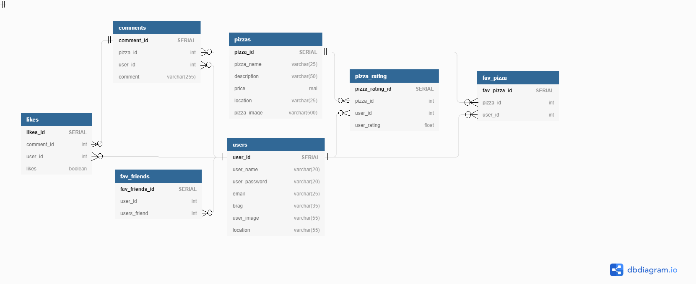

# SlashDotPizza

## Trello board
>
>
>>Link: https://trello.com/b/IpJSs2bU/slashdotpizza

## Overview
The name ?  ever played Everquest back in the early 2000s ? they put a command /pizza in game, that could be run at anytime, that would launch a browser and allow the player to order pizza right then and there. Well, this is nothing like it.   This API was designed with just the pizza in mind.  Not every store is on uber eats etc, but most, if not all have a website,  and being in Meblourne there is quite a lot of choice for pizza, quite spoilt for choice actually with every corner thinking they can make the best pizza in Melbourne.  There is the mark ups and all that jazz on the popular delivery apps if you go that route.  What this API aims to do is give access from a dump of all known pizza shops in Melbourne with their current menu/prices.  The user will not be able to order through the application but merely give them information of what pizza is available - which shop is selling it and what else they have and price, where the shop is, link to their website and call them(might remove this but its aplace holder for now - as the user can techincally call the shop and place an order)  Whilst the user can then rate it, comment on it, make friends and share their pizza finds with each other.  

## Local Install Steps

The app makes use of the venv pip package to create a virtual environment. Therefore the package will need to be installed in order to run the app. There after the install instructions are as below:

- Clone the repo: `git clone https://github.com/Jim-Read/SlashDotPizza_sideapp2.git`
- Change directory into the repo: `cd demo_app`
- Make sure venv is installed: `pip3 install venv`
- Create the virtual environment: `python3 -m venv venv`
- Activate the virtual environment: `source venv/bin/activate`
- Install the dependencies from requirments.txt: `pip3 install -r requirements.txt`
- Run the app: `python3 main.py`

## CI/CD

The CI/CD pipeline was created using Github Actions. It uses Python3.8, Pip3 and runs on the latest stable version of Ubuntu. The pipeline is started on a push to master.

Once it has pulled from master it installs the dependencies form requirements.txt and then it runs the tests in the tests directory.

## Wireframes

### Known missing wire frames

- Display current 5 highest ranks pizzas in your area / on app / overall 

### Landing page

The landing page is where the user start and where they can log in or create an account. Visually apealing anda brief idea of what site is about. It has an banner image in the middle with an idea od what site is about, background colours and imagery are used enhance the sites goals.

### Login and signup

The user clicks login and a new screen appears presenting them with the options to login with their username and password, the forgot password option is available and will check their email address and reset their password and send it to them to change.  User is also presented with the sign up option.  Button persists incase they want to sign up instead of log in. Sign up takes user to a new window.  By defualt after user signs up, the main window will return presenting user successful sign up, and to proceed to log in.

### User profile page

##### This page will be presented to a new user who signs in for the first time.  

- User can update their email or update their password and add a display image
- User sets a location or 2, 3 etc. Information is used to get information for user.
- The user will be able to update and delete their profile

### Dashboard page

This page is specific to each user. Depending on which location tab is selected, information presented varies slightly.  Its main features are;

- Display all the current pizzas in a known location and outward radius of set type
- View a brief desccription of pizza and be able to click on it for more information
- Search for particular pizza
- CHange how items are displayed to screen - sort by rating, price, distance, grid or list (if menu in grid two arrows appear left and right to navaigate through - mouse wheel down and up and move it left and right too)
- Logout button
- Dashboard for mobile is a list where the user can tap on the pizza to get more options, website users click on the pizza to get more information and options

### View friends and Pizza page/popup

A user who clicks on a friends icon in their profile, or an username head on comments, or even other people in friends list will be able to see all their favourited pizzas, their friends (if they choose to make public for both) their display picture, brag quote (brag is used if the user liked the pizza so much that the are willing to put props right under their name on their profile - clickable link to pizza) User can friend request other people.

This is a pop up on desktop and another screen in mobile

Pizza popup (for web) Displays the picture of the pizza, what its called, description, price, your rating, average rating.  Buttons to view or make comments (another screen that fills this window when clicked) An add button to add this pizza to your favourites, and the brag button - to tell the world (under your profile anyway that anyone can see if they view your profile) that you realllllly like this particular pizza (might set up default response user can select)

### View/create/delete/edit Comments About Pizza

- When a user clicks on comments about a pizza they are able to view existing comments about the pizza in greater detail.
- User can add pizza to favourite if on webpage - otherwise the mobile user has to back out once and add as favourite
- User can read all comments. They can add, edit, delete their own comments.
- User is able to upvote or downvote a comment.

## WIP DB Schema

1.	Users can create an account and store in their details in the user table and create a password which is stored in the user_login_password table
2.	When a user logs in, the password is checked in the user_login_password table for a match
3.	A user can store their location in the location table and are able to store many locations for themselves only.
4.	A user can store many or no users as friends in fav_friends 
5.	A user can store many or no pizza as favourites in fav_pizza 
6.	A pizza table is created to store the details about a pizza
7.	A pizza can have many or no pizza_ratings for it
8.	A pizza can have many comments or none
9.	A comment on a pizza can have many likes or none

## WIP Endpoints

WIP - still need to flesh out the code/tests within the endpoints - basic endpoints created in swagger and hosted for now

https://app.swaggerhub.com/apis-docs/slashdotpizza/SlashDotPizza/0.0.2

## CLI Commands

The RDS database can be interacted with the following commands from a virtual environment

Ensure the environment variables are set in the terminal session

>>export FLASK_APP=main.py
>>export FLASK_ENV=development

You can now check to see if the CLI commands are now loaded into the terminal session

>> flask --help

At the bottom you will see the Commands: section and the name that you created

To see more information about what you can do with the command

>> flask (command_name) --help

A new menu will show the commands now available

To use the CLI commands
>> flask (command_name) (option)
>> the option will be whatever method you assigned for the command
